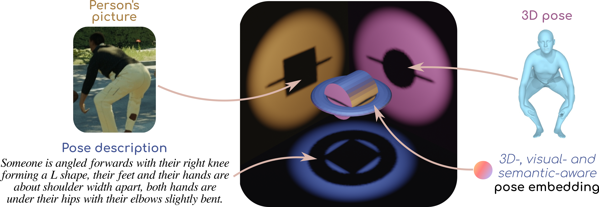

# PoseEmbroider

This repository is the official PyTorch implementation for the paper **["PoseEmbroider:Towards a 3D, Visual, Semantic-aware Human Pose Representation"](https://europe.naverlabs.com/research/publications-enhanced/poseembroider-towards-a-3d-visual-semantic-aware-human-pose-representation)** (**ECCV 2024**).


## Overall idea



The PoseEmbroider builds on the idea that all modalities are only *partial* views of the same concept.
Metaphorically, modalities are like 2D shadows of a 3D object. Each 2D shadow is informative in its own way, but is also only partial. Put together, they make it possible to reach a better understanding of the core concept. In this project, we train a model with all these three complementary, partial yet valuable, modalities so as to derive a generic 3D-, visual- and semantic- aware pose representation.

To do so, we use a subset of input modality embeddings obtained from pretrained, frozen modality-specific encoders. We feed these modality embeddings to a transformer, which outputs the generic pose representation through an added special token (step 1). This generic pose representation is then reprojected into uni-modal spaces, where it is compared to the original modality embeddings (step 2). Metaphorically, we try to approximate the 3D object in the picture from the available shadows (step 1), then we assess the quality of the reconstruction by checking that the shadows are matching (step 2). 

We showcase the potential of our proposed representation on two downstream applications: human mesh recovery and the posefix corrective instruction task, where the goal is to generate a text explaining how to modify one pose into another.

For more information, check the [5-minute video](https://www.youtube.com/watch?v=Cltmvpjq-Us), or [the paper](https://arxiv.org/abs/2409.06535).

## Setup


#### :snake: Create python environment

<details>
<summary>Click for details.</summary>
This code was tested in a python 3.8 environment.

From the main code directory:

```bash
pip install -r requirements.txt
python setup.py develop
```

If problems with OpenGL (setting: linux, anaconda3), check [here](https://stackoverflow.com/a/72427700).

Please also install & setup the [PoseScript/PoseFix repo](https://github.com/naver/posescript). No need to follow instructions past the "Create python environment" section, just install the repo, and, based on your system (location preferences), edit '_./src/text2pose/config.py_' to set your preferred values for:
* `TRANSFORMER_CACHE_DIR` (see more about it after)
* `SELFCONTACT_ESSENTIALS_DIR` (see instructions in the abovementioned repo)
* `SMPLX_BODY_MODEL_PATH` (see more about this after)
* `NB_INPUT_JOINTS` (will likely be overwritten by input arguments anyway)

In general, you can define you favorite paths for data storage in _./src/poseembroider/config.py_ (eg. `DATA_CACHE_DIR`, `TORCH_CACHE_DIR` ...); see more about these below.

</details>


#### :inbox_tray: Download data & tools

<details>
<summary>Click for details.</summary>

:warning: Note that in the table below, directories are indicated as `<BLAH_BLAH_BLAH>`, but refer to the values of the corresponding variables in _./src/poseembroider/config.py_. Change paths following your own preferences.

| What | Download instructions | Where to store |
| --- | --- | --- | 
| SMPL-X body models | Visit [the smpl-x website](https://smpl-x.is.tue.mpg.de/download.php), go to the "Download" tab and choose _"Download SMPL-X v1.1 (NPZ+PKL, 830 MB) - Use this for SMPL-X Python codebase"_. | in directory `<SMPLX_BODY_MODEL_PATH>` (`smplx` should be a direct subdir) |
| BEDLAM data <br> (images + csv) | Visit the [BEDLAM website](https://bedlam.is.tue.mpg.de/), go on the "Download" tab, then follow instructions under _"Download instructions for synthetic image data (30fps)"_. | **Step 1**: move the obtained `csv` subfolder into `<BEDLAM_RAW_DATA_DIR>` and untar included archives. <br> **Step 2:** define as `<BEDLAM_IMG_DIR>` the directory containing the obtained `training` and `validation` image folders. |
| BEDLAM data <br>  (ground truth poses) | Visit the [BEDLAM website](https://bedlam.is.tue.mpg.de/), go on the "Download" tab, then get the _SMPL-X neutral ground truth/animation files_. | in directory `<BEDLAM_RAW_DATA_DIR>` (the unzipped `neutral_ground_truth_motioninfo` should be a direct subdir) |
| BEDLAM data <br> (_downsample_mat_smplx.pkl_) | [Click to download](https://github.com/pixelite1201/BEDLAM/raw/master/data_processing/downsample_mat_smplx.pkl). <br> (origin: BEDLAM official github.) | in directory `<BEDLAM_RAW_DATA_DIR>` (should be a direct subfile)|
| PoseFix data <br> (pose pairs & texts) | [Click to download](https://download.europe.naverlabs.com/ComputerVision/PoseFix/posefix_dataset_release.zip). | in directory `<POSEFIX_DIR>` (should contain the .json files) |
| PoseFix data <br> (pose data) | Visit the [AMASS website](https://amass.is.tue.mpg.de/), go on the "Download" tab, then download SMPL-**H** sequences for the subdatasets listed in [this section](https://github.com/naver/posescript?tab=readme-ov-file#inbox_tray-download-data). | store it in you favorite location and indicate the path to the global directory under `AMASS_FILE_LOCATION_SMPLH` in _src/poseembroider/datasets/process_posefix/extract_to_obj.py_ |
| SMPLer-X image encoder weights | [Click to download](https://pjlab-my.sharepoint.cn/:u:/g/personal/openmmlab_pjlab_org_cn/EVcRBwNOQl9OtWhnCU54l58BzJaYEPxcFIw7u_GnnlPZiA?e=nPqMjz). <br> (origin: [SMPLer-X official github](https://github.com/caizhongang/SMPLer-X?tab=readme-ov-file#pretrained-models), SMPLer-X-B32 (base)) | in directory `<TORCH_CACHE_DIR>/smplerx` |
| PoseText model trained on BEDLAM-Script ; providing the text encoder weights | [Click to download](https://download.europe.naverlabs.com/ComputerVision/PoseEmbroider/posetext_model_bedlamscript.zip). | store it in your favorite location, and indicate the **absolute** path to the checkpoint file in _src/poseembroider/shortname_2_model_path.json_ under shortname `posetext_model_bedlamscript` |
| VAE model trained on the poses of BEDLAM-Script : providing the pose encoder weights | [Click to download](https://download.europe.naverlabs.com/ComputerVision/PoseEmbroider/posevae_model_bedlamscript.zip). | store it in your favorite location, and indicate the **absolute** path to the checkpoint file in _src/poseembroider/shortname_2_model_path.json_ under shortname `posevae_model_bedlamscript` |

</details>

#### :hammer: Format BEDLAM

<details>
<summary>Click for details.</summary>

This project resorts to the BEDLAM dataset for training: animation files are parsed for pose extraction, selection, pairing and captioning.
To process BEDLAM for this project:

1. Download BEDLAM data, the SMPL-X body model and the PoseText model (see previous section).
2. Complete the repo by running:
    ```bash
    cd src/poseembroider

    # download the original file version for the step 1 of the process
    wget https://raw.githubusercontent.com/pixelite1201/BEDLAM/refs/heads/master/data_processing/df_full_body.py # from commit 099ab0ef8eb4c7737c0ca038e7010238dccbeed6
    mv df_full_body.py datasets/process_bedlam/process_bedlam_step1.py
    
    # modify the file of the step 1 so it does everything we want
    sh datasets/process_bedlam/modify_step1_file.sh
    ```
3. Run:
    ```bash
    # (still from src/poseembroider)
    sh datasets/process_bedlam/do.sh
    ```

**Note:** the process is quite long (~35 hours).
If you are interested in BEDLAM-Script only, you can comment steps 6 and 7 in the bash script (gain 5-6 hours).
You can also comment the lines related to the train split if you are interested in testing only (gain 29 hours).
Multiple caches are created along the way not to have to relaunch the whole process from scratch in case something unexpected happens.

You can check dataset samples by running:
```bash
cd src/poseembroider
# For BEDLAM-Script examples:
streamlit run datasets/visualize_dataset_script.py
# For BEDLAM-Fix examples:
streamlit run datasets/visualize_dataset_fix.py
```
</details>

#### :hammer: Format PoseFix

<details>
<summary>Click for details.</summary>
PoseFix is needed to train the head for human pose instruction generation.

PoseFix is originally given in SMPL-H format. To convert the dataset to SMPL-X format, please follow [these indications](./src/poseembroider/datasets/process_posefix/README.md).

Then, you can check dataset samples by running:
```bash
cd src/poseembroider
streamlit run datasets/visualize_dataset_fix.py
```
</details>

#### :hammer: Compute the mean SMPL-X pose (optional)

<details>
<summary>Click for details.</summary>
This step is not necessary to use the released pretrained models.

The mean SMPL-X pose is needed to train the SMPL-X regression head, an iterative residual network, mounted on top of the PoseEmbroider. To compute it:

1. Format BEDLAM (see previous section).
2. Create BEDLAM caches:
    ```bash
    cd ./src/poseembroider
    python datasets/bedlam_script.py
    ```
3. Compute the mean pose:
    ```bash
    # (from ./src/poseembroider)
    python datasets/other/compute_mean_smplx_pose.py
    ```
    *Note:* to optionally display the mean pose, run `streamlit run datasets/other/compute_mean_smplx_pose.py -- --display` instead.
</details>


#### :hammer: Get the SMPLer-X image encoder

<details>
<summary>Click for details.</summary>
The PoseEmbroider framework makes use of the pretrained SMPLer-X image encoder (ViT base). Run the following to extract the source code of the ViT backbone useful for this project:

```bash
cd ./src/poseembroider

# NOTE: experimented with the file from commit 857a3ecbae76bf4ac50534a8d33c1db49d898190
wget https://raw.githubusercontent.com/caizhongang/SMPLer-X/refs/heads/main/main/transformer_utils/mmpose/models/backbones/vit.py
mv vit.py smplerx_image_backbone.py

# change lines to remove extra-dependencies
# (start from the end of the file to limit confusions with respect to line numbers)
# For information:
# * `sed -i 'Xi something' file.py` adds 'something' before line numbered X
# * `sed -i 'X,Yd' file.py` removes lines X through Y

myfile='smplerx_image_backbone.py'
sed -i '285i \
        else:\
            raise NotImplementedError' $myfile
sed -i '272,273d' $myfile
sed -i '177i \
class ViT(nn.Module):' $myfile
sed -i '175,176d' $myfile
sed -i '11,13d' $myfile
sed -i '7d' $myfile
sed -i '2d' $myfile
```
</details>


#### :books: Download language models

<details>
<summary>Click for details.</summary>

* Define where to save the pretrained language models, by modifiying the value of `TRANSFORMER_CACHE_DIR` in *./src/poseembroider/config.py* following your own preferences.

* Download HuggingFace checkpoints, by running the following python script:
  ```python
  import os
  from transformers import AutoTokenizer, AutoModel
  import poseembroider.config as config

  model_type = "distilbert-base-uncased"

  # download the tokenizer
  tokenizer = AutoTokenizer.from_pretrained(model_type)
  tokenizer.save_pretrained(os.path.join(config.TRANSFORMER_CACHE_DIR, model_type))

  # download the encoder
  text_enc = AutoModel.from_pretrained(model_type)
  text_enc.save_pretrained(os.path.join(config.TRANSFORMER_CACHE_DIR, model_type))
  ```
</details>

## Demos

To visualize the results of the trained models, run commands below from *./src/poseembroider*:

| Model | Command | Shortnames |
| --- | --- | --- |
| PoseEmbroider / Aligner | `streamlit run demo_core.py -- --model_path ${model_path}` | `poseembroider_model_bedlamscript` <br> `aligner_model_bedlamscript` |
| HPSEstimator <br> (pose estimation) | `streamlit run downstream/pose_estimation/demo_pose_estimation.py -- --model_path ${model_path}` | `hpsestimator_model_poseembroider_bedlamscript` <br> `hpsestimator_model_aligner_bedlamscript` |
| InstructionGenerator <br> (generation of corrective pose instructions) | `streamlit run downstream/instruction_generation/demo_instruction_generation.py -- --model_path ${model_path}` | `instructgen_model_poseembroider_bedlamfix_posefix` <br> `instructgen_model_aligner_bedlamfix_posefix` |

Shortnames in the third column indicate possible models to try out in each case; check out the file *./src/poseembroider/shortname_2_model_path.json*. to get the corresponding `${model_path}`.


## Evaluate models

In general, you can evaluate each model using their dedicated "evaluate_${model_type}.py" file, as follow:

```bash
python ${path_to_file}/evaluate_${model_type}.py --dataset ${dataset_name} --model_path ${model_path} --split ${split} 
```

See for instance the commands in the table below (all commands and paths below are expected to be run and work from *./src/poseembroider*):

| Model | Evaluation command | Inferrence time |
| --- | --- | --- |
| PoseEmbroider/Aligner | `python evaluate_core.py --dataset "bedlamscript-overlap30_res224_j16_sf11" --model_path ${your_model_path} --split 'val'` | Below 4 minutes for a 10k-sized set (9 query types per sample), on a V100 |
| HPSEstimator <br> (pose estimation) | *On BEDLAM-Script:* <br> `python downstream/pose_estimation/evaluate_pose_estimation.py --dataset "bedlamscript-overlap30_res224_j16_sf11" --split 'val' --model_path ${your_model_path}` <br> *On 3DPW:* <br> `python downstream/pose_estimation/evaluate_pose_estimation.py --dataset "threedpw-sf1" --split 'test' --model_path ${your_model_path}` | About 1 minute for 10k queries on a V100 | 
| InstructionGenerator <br> (generation of corrective pose instructions) | *On BEDLAM-Fix:* <br> `python downstream/instruction_generation/evaluate_instruction_generation.py --dataset "bedlamfix-overlap30_res224_j16_sf11-in15_out20_t05_sim0709" --textret_model 'pairtext_model_ft_bedlamfix_posefix' --split 'val' --model_path ${your_model_path}`  <br> *On PoseFix-H (out-of-sequence pairs):* <br> `python downstream/instruction_generation/evaluate_instruction_generation.py --dataset "posefix-H" --textret_model 'pairtext_model_ft_bedlamfix_posefix' --pair_kind 'out' --split 'test' --model_path ${your_model_path}` | About 40 seconds for 709 queries on a V100 |

To evaluate the released pretrained models, check out the shortnames of the task-dependent eligible models using the table from the previous section ("Demos"), then gather the corresponding `${model_path}` from the file *./src/poseembroider/shortname_2_model_path.json*.


## Train models

<details>
<summary>Click for details.</summary>

All commands and paths below are to be run from *./src/poseembroider*.

### Pose encoder

```bash
python assisting_models/poseVAE/train_poseVAE.py --dataset "bedlamscript-overlap30_res224_j16_sf11" \
--model PoseVAE --latentD 32 --num_body_joints 22 \
--wloss_v2v 1.0 --wloss_rot 1.0 --wloss_jts 1.0 --wloss_kld 1.0 --wloss_kldnpmul 1.0 --kld_epsilon 10.0 \
--lr 1e-05 --wd 0.0001 \
--log_step 100 --val_every 20 \
--batch_size 128 --epochs 2000 --seed 1
```
Please register the model path in *shortname_2_model_path.json*, under shortname `posevae_model_bedlamscript`.

This model gives the "posevae" encoder model used for the PoseEmbroider / Aligner.


### Text encoder

```bash
python assisting_models/poseText/train_poseText.py --dataset "bedlamscript-overlap30_res224_j16_sf11" \
--model PoseText --latentD 512 --text_encoder_name 'distilbertUncased' --transformer_topping "avgp" \
--num_body_joints 22 \
--retrieval_loss 'symBBC' \
--lr 0.0002 --lr_scheduler "stepLR" --lr_step 400 --lr_gamma 0.5 \
--log_step 20 --val_every 20 \
--batch_size 128 --epochs 500 --seed 1
```
Please register the model path in *shortname_2_model_path.json*, under shortname `posetext_model_bedlamscript`.

This model gives the "posetext" encoder model used for the PoseEmbroider / Aligner. It also gives the semantic features required for building the pose pairs of BEDLAM-Fix. 


### PairText evaluation model

This model's training is performed in 2 steps; see the table below for step-specific additional arguments.

```bash
python assisting_models/pairText/train_pairText.py --model PairText \
--num_body_joints 22 --latentD 512 --text_encoder_name 'distilbertUncased' --transformer_topping "avgp" \
--retrieval_loss 'symBBC' \
--lr 0.00005 --lr_scheduler "stepLR" --lr_gamma 0.5 \
--log_step 50 \
--batch_size 128 --seed 1 \
<additional arguments, see table below>
```

Please complete the command above with the following step-specific arguments:

| Step | Additional arguments |
| --- | --- |
| Pretraining step | `--dataset "bedlamfix-overlap30_res224_j16_sf11-in15_out20_t05_sim0709" \`<br> `--epochs 400 --lr_step 400 --val_every 20 ` |
| Finetuning step | `--datasets "posefix-H" "bedlamfix-overlap30_res224_j16_sf11-in15_out20_t05_sim0709" \`<br> `--epochs 250 --lr_step 40 --val_every 10 \`<br>`--apply_LR_augmentation --pretrained 'pairtext_model_bedlamfix'` |

Before launching the finetuning step, please register the path of the model from the pretraining step in *shortname_2_model_path.json*, under shortname `pairtext_model_bedlamfix`. Then register the path of the model from the finetuning step in *shortname_2_model_path.json*, under shortname `pairtext_model_ft_bedlamfix_posefix`.

This model serves to evaluate text generation models producing (3D) pose corrective instructions.

### PoseEmbroider / Aligner, and ablatives

```bash
python train_core.py --dataset "bedlamscript-overlap30_res224_j16_sf11" \
--latentD 512 --l2normalize --num_body_joints 22 \
--image_encoder_name 'smplerx_vitb32' \
--pose_encoder_name 'posevae' \
--text_encoder_name 'posetext' \
--encoder_projection_type 'layerplus' \
--retrieval_loss 'symBBC' --single_partials --dual_partials \
--lr 0.0002 --lr_scheduler "stepLR" --lr_step 400 --lr_gamma 0.5 \
--log_step 50 --val_every 5 \
--batch_size 128 --epochs 350 --seed 1 \
<additional arguments, see table below>
```

Please complete the command above depending on the model version you are interested in:

| Version | Additional arguments |
| --- | --- |
| Aligner | `--model 'Aligner' --external_encoder_projection_type 'mediummlpxs'` |
| PoseEmbroider | `--model 'PoseEmbroider' --external_encoder_projection_type 'none' --embroider_core_type 'transformer'` |
| PoseEmbroider, without projection heads | `--model 'PoseEmbroider' --external_encoder_projection_type 'none' --embroider_core_type 'transformer' --no_projection_heads` |
| PoseEmbroider, MLP core | `--model 'PoseEmbroider' --external_encoder_projection_type 'none' --embroider_core_type 'mlp'` |

Please register the paths of the trained models in *shortname_2_model_path.json* under desired shortnames for further use.

### Downstream: pose estimation

Time/memory trade-off: you can cache the representation features first, then train the neural head on the cached features.

**Command for caching the representation features**:
```bash
for split in 'train' 'val'; do
    python downstream/cache_intermodality_features.py \
    --dataset "bedlamscript-overlap30_res224_j16_sf11" --split $split \
    --model_path <path_to_the_model_(PoseEmbroider/Aligner)_from_which_to_extrac_the_intermodality_features> \
    --input_types 'images'
done
```
Please complete the command above with the desired value; make sure to have a shortname entry in *shortname_2_model_path.json* for the given model path.

:warning: Pay attention to the printed filemark (based on the epoch of the model)!

**Training command:**
```bash
python downstream/pose_estimation/train_pose_estimation.py --dataset "bedlamscript-overlap30_res224_j16_sf11" \
--model HPSEstimator --latentD 512 \
--num_body_joints 22 --num_shape_coeffs 10 --predict_bodyshape \
--representation_model_input_types 'images' \
--pretrained_representation_model <shortname_to_pretrained_representation_model> \
--cached_embeddings_file <cached_embeddings_file_mark_(based_on_the_epoch_of_the_model_that_produced_the_features)> \
--no_img_augmentation \
--lr 0.0001 --wd 0.0001 \
--log_step 100 --val_every 1 \
--batch_size 64 --epochs 100 --seed 1
```
Please complete the command above with the desired values:
* `<shortname_to_pretrained_representation_model>`: shortname of the model used to derive input representation (if using cached embeddings, it is the shortname corresponding to the path given as inpu to the previous command)
* `<cached_embeddings_file_mark_(based_on_the_epoch_of_the_model_that_produced_the_features)>`: makes it possible to identify the version of cached embeddings, if several for the same model. The value is printed by the script producing the cached features, and it looks like "e<epoch_number>".

*Note: if you don't want to use cached features, remove the `--cached_embeddings_file` argument. Then you can also remove `--no_img_augmentation` if you like.*

### Downstream: pose correction instruction

Time/memory trade-off: you can cache the representation features first, then train the neural head on the cached features.

**Command for caching the representation features**:
```bash
for dataset in 'posefix-H' 'bedlamfix-overlap30_res224_j16_sf11-in15_out20_t05_sim0709'; do
    for split in 'train' 'val'; do
        python downstream/cache_intermodality_features.py \
        --dataset $dataset --split $split \
        --model_path <path_to_the_model_(PoseEmbroider/Aligner)_from_which_to_extract_the_intermodality_features> \
        --input_types 'poses'
    done
done
```
Please complete the command above with the desired value.

:warning: Pay attention to the printed filemark (based on the epoch of the model)!

**Training command:**

This model's training is performed in 2 steps; see the table below for step-specific additional commands.

```bash
python downstream/instruction_generation/train_instruction_generation.py \
--model InstructionGenerator --latentD 512 --num_body_joints 22 \
--text_decoder_name "transformer_distilbertUncased" --transformer_mode 'crossattention' \
--decoder_nhead 8 --decoder_nlayers 4 --comparison_latentD 512 --decoder_latentD 512 \
--comparison_module_mode 'tirg' \
--representation_model_input_types 'poses' \
--pretrained_representation_model <shortname_to_pretrained_representation_model> \
--cached_embeddings_file <cached_embeddings_file_mark_(based_on_the_epoch_of_the_model_that_produced_the_features)> \
--lr 0.0001 --wd 0.0001 \
--log_step 100 --val_every 20 --textret_model 'pairtext_model_ft_bedlamfix_posefix' \
--batch_size 64 --seed 1 \
<additional arguments, see table below>
```

Please complete the command above with the desired values (similarly as for the pose estimation downstream), and the following step-specific arguments:
| Step | Additional arguments |
| --- | --- |
| Pretraining step | `--dataset "bedlamfix-overlap30_res224_j16_sf11-in15_out20_t05_sim0709" --epochs 900` |
| Finetuning step | `--datasets "posefix-H" "bedlamfix-overlap30_res224_j16_sf11-in15_out20_t05_sim0709" \` <br> `--pair_kinds "out" "any" --epochs 300 \` <br> `--pretrained "<shortname_to_model_from_the_pretraining_step>"` |

Before launching the finetuning step, please register the path of the model from the pretraining step in *shortname_2_model_path.json*, under your preferred shortname, also labeled in the command of the finetuning step as `<shortname_to_model_from_the_pretraining_step>` (replace with the actual value).

*Note: if you don't want to use cached features, remove the `--cached_embeddings_file` argument.*

</details>


## Disclaimers

_The code is shared in the hope it can be useful, but as many things, it is not perfect:_
* _You may encounter issues regarding the environment setup (instructions may be incomplete)._
* _Some small parts of the code are missing (essentially the parsing of 3DPW ; but hopefully there is enough online about it to fill in the gaps)._
* _Some processes are not yet perfectly satisfactory (eg. pose normalization)._

_Please feel free to share your solutions!_

## Citation

If you use this code, please cite the corresponding paper:

```bibtex
@inproceedings{delmas2024poseembroider,
  title={PoseEmbroider: Towards a 3D, Visual, Semantic-aware Human Pose Representation},
  author={Delmas, Ginger and Weinzaepfel, Philippe and Moreno-Noguer, Francesc and Rogez, Gr{\'e}gory},
  booktitle={ECCV},
  year={2024}
}
```

## License

This code is distributed under the CC BY-NC-SA 4.0 License. See [LICENSE](LICENSE) for more information.

Note that some of the softwares to download and install for this project are subject to separate copyright notices and license terms, which use is subject to the terms and conditions under which they are made available.
