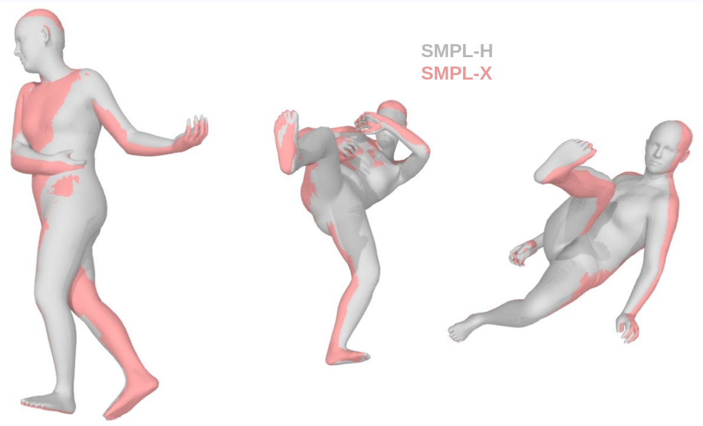

# Format PoseFix

This README describes how to convert the PoseScript/PoseFix poses (extracted from AMASS, in SMPL-H format) to SMPL-X.

## Context

AMASS poses are originally provided in SMPL-H format, and a large majority of them is now [officially](https://amass.is.tue.mpg.de/download.php) available in SMPL-X format too. However:
* the SMPL-X version of some sequences used in the PoseScript/PoseFix datasets (essentially from the DanceDB and BMLhandball subdatasets) are missing.
* it seems like the released SMPL-X versions were not obtained from a "conversion" of the SMPL-H version, but rather from a "re-optimization" (by running Mosh++ on the MoCap markers directly; see [announcement](https://amass.is.tue.mpg.de/news.html) from the 2022-02-14). As a consequence, the SMPL-H version and the SMPL-X version of the same pose may differ.

The problem is that PoseScript and PoseFix were obtained by annotating the poses in their SMPL-H version. The annotations supposedly describe very subtle pose details, which may not hold anymore for the SMPL-X version of these same poses.

Hence, **so as reduce potential discrepancy, cover all included poses in PoseScript/PoseFix, and obtain preferred pose specificities, we propose here to run the conversion code on the original AMASS poses used in PoseScript/PoseFix**:

* **Input**: PoseScript/PoseFix poses, in SMPL-H format, *with the neutral body and 0-shape* (poses presented for annotation in PoseScript/PoseFix).
* **Output**: PoseScript/PoseFix poses, in SMPL-X format, *with the neutral body and 0-shape*.

## How to

:warning: Please note that no further code will be run from this very repo. Unless otherwise stated, filepaths below are to be understood with respect to a clone of the [smplx repo](https://github.com/vchoutas/smplx).

### Get SMPL-H body models for the smplx codebase

**Note**: this step is OPTIONAL! It makes it possible to use the SMPL-H body models, for the AMASS data, from the smplx [code base](https://github.com/vchoutas/smplx), instead of the SMPL-H body models from the [AMASS code base](https://github.com/nghorbani/human_body_prior/tree/master). But if you have already everything needed for the *human_body_prior* library, you don't need to do this step.

1. Clone the smplx repo somewhere on your machine.

    ```bash
    git clone https://github.com/vchoutas/smplx.git
    ``` 

2. Follow [these instructions](https://github.com/vchoutas/smplx/blob/main/tools/README.md) to obtain Chumpy-free SMPL-H+MANO body merges `.pkl` files. The location of these files is labeled `AMASS_BODY_MODEL_SMPLX_CODEBASE` in what follows, and must be written at the top of *extract_to_obj.py* (see later).

    <details>
    <summary><i>Detailed procedure we did...</i></summary>

    1. Download data from the [AMASS website](https://amass.is.tue.mpg.de/):

        | Downloaded element | Name on system | 
        | --- | --- |
        | zip folder from "Models & Code" | `mano_v1_2` |
        | zip folder from "Extended SMPL+H model" | `smplh_body_models_amass_data_for_amass_codebase` |
    
    2. Prepare environments:
        * `ENV1`: environment in python 2, to remove chumpy data
        * `ENV2`: environment in python 3, with the smplx library

    3. Run the following (:warning: replace values between "`<>`"):

        ```bash
        cd <smplx repo>

        conda activate ENV1 # python 2 environment, to remove chumpy data...

        python tools/clean_ch.py \
        --input-models <your download location>/mano_v1_2/models/*.pkl \
        --output-folder <your download location>/mano_v1_2/models/no_chumpy

        conda activate ENV2 # python 3 environment, with the smplx library accessible

        python tools/merge_smplh_mano.py \
        --smplh-fn <your download location>/smplh_body_models_amass_data_for_amass_codebase/neutral/model.npz \
        --mano-left-fn <your download location>/mano_v1_2/models/no_chumpy/MANO_LEFT.pkl \
        --mano-right-fn <your download location>/mano_v1_2/models/no_chumpy/MANO_RIGHT.pkl \
        --output-folder <your download location>/smplh_body_models_amass_data_for_smplx_codebase/neutral

        # get the file system as: smplh_body_models_amass_data_for_smplx_codebase/smplh/SMPLH_NEUTRAL.pkl
        mv <your download location>/smplh_body_models_amass_data_for_smplx_codebase/neutral/model.pkl <your download location>/smplh_body_models_amass_data_for_smplx_codebase/smplh/model.pkl
        mv <your download location>/smplh_body_models_amass_data_for_smplx_codebase/smplh/model.pkl <your download location>/smplh_body_models_amass_data_for_smplx_codebase/smplh/SMPLH_NEUTRAL.pkl
        ```
    4. `AMASS_BODY_MODEL_SMPLX_CODEBASE` is `<your download location>/smplh_body_models_amass_data_for_smplx_codebase`. Complete accordingly the corresponding field at the top of *extract_to_obj.py*. 

    </details>

3. In the file *extract_to_obj.py*, you can now set `ANNOTATION_MODE` to False if you like.

### &#x1F4F9; Aaaand... action!

1. Check the file *extract_to_obj.py* next to this very README.md; and change the values marked with "TODO" at the top of the file, depending on your file system.

2. Run the script (duration ~10 minutes):

    ```bash
    python extract_to_obj.py
    ```

    This script extracts the poses from AMASS that belong to PoseScript/PoseFix, and feed them to the SMPL-H body model to get the corresponding mesh (using the neutral body gender and the default shape parameters), which is saved as a `.obj` file. Note that we are interested in the vertex positions only.

    *Note that the script above uses the SMPL-H body model from the [AMASS codebase](https://github.com/nghorbani/human_body_prior/tree/master) by default (that's how the data was shown to the annotators). However, one can use the [smplx codebase](https://github.com/vchoutas/smplx/tree/main) by setting `ANNOTATION_MODE` to `False` at the beginning of the script. The result should be the same.*

    **NOTE: The conversion process is further described on the official smplx repo, [here](https://github.com/vchoutas/smplx/tree/main/transfer_model). For convenience, we detail below how we proceeded.**

3. Clone the smplx repo somewhere on your machine if you have not already.

    ```bash
    git clone https://github.com/vchoutas/smplx.git
    ``` 

4. Install & download needed packages.

    Install the environment suggested in the [smplx repo](https://github.com/vchoutas/smplx/tree/main/transfer_model#requirements), in addition with the following:
    ```bash
    pip install smplx roma
    pip install git+https://github.com/MPI-IS/mesh.git
    ```

5. Modify some files in the smplx repo (`transfer_model` subdirectory).

    <details>
    <summary><i>Debug...</i></summary>

    * Maybe we missed something at some point, but we had to modify the files [`__main__.py`](https://github.com/vchoutas/smplx/blob/main/transfer_model/__main__.py) & [`transfer_model.py`](https://github.com/vchoutas/smplx/blob/main/transfer_model/transfer_model.py), to resolve import errors. In particular:
        * **__main__.py**:
            * removing the dot between `from` and each of *`config`*, *`data`* and *`utils`*:
                https://github.com/vchoutas/smplx/blob/1265df7ba545e8b00f72e7c557c766e15c71632f/transfer_model/__main__.py#L30-L33
            * At the top of the file, adding: `import os, sys; sys.path.append(os.path.dirname(os.path.realpath(__file__)))`
        * **transfer_model.py**:
            * removing the dot between `from` and each of *`utils`*, *`optimizers`*, *`utils`* (line below) and *`losses`*:
                https://github.com/vchoutas/smplx/blob/1265df7ba545e8b00f72e7c557c766e15c71632f/transfer_model/transfer_model.py#L26-L31
            * At the top of the file, adding: `import os, sys; sys.path.append(os.path.dirname(os.path.realpath(__file__)))`
    * Also modifying `transfer_model.py` due to TypeError & others (see [problem](https://github.com/vchoutas/smplx/issues/166) and [solution](https://github.com/vchoutas/smplx/issues/138)). See specific changes below:
        ```python
        # NOTE: changed 3 times in the file
        # est_vertices = body_model_output['vertices'] # COMMENT
        est_vertices = body_model_output.vertices # ADD

        # NOTE: changed bu may not be required
        # var_dict.update(body_model_output) # COMMENT
        var_dict.update(body_model_output._asdict()) # ADD
        ```
    </details>

    <details>
    <summary><i>Functional modifications...</i></summary>

    * Modifying [`__main__.py`](https://github.com/vchoutas/smplx/blob/main/transfer_model/__main__.py):
        1. Commenting lines at the end of the file not to save an `.obj` file for the optimized smplx body:
        https://github.com/vchoutas/smplx/blob/1265df7ba545e8b00f72e7c557c766e15c71632f/transfer_model/__main__.py#L96-L100
        2. Modifying to save only pose data in axis-angle representation, on cpu (otherwise what is saved is automatically loaded as cuda). Specifically, added:
            ```python
            # ADDED:
            # * transfer data to cpu
            # * use the axis-angle representation
            kept_fields = ['global_orient', 'body_pose', 'betas', 'left_hand_pose', 'right_hand_pose', 'jaw_pose', 'leye_pose', 'reye_pose']
            # (available: ['transl', 'global_orient', 'body_pose', 'betas', 'left_hand_pose', 'right_hand_pose', 'jaw_pose', 'leye_pose', 'reye_pose', 'expression', 'vertices', 'joints', 'full_pose', 'v_shaped', 'faces'])
            var_dict = {k:var_dict[k].to('cpu') for k in kept_fields}
            for k in ['global_orient', 'body_pose', 'left_hand_pose', 'right_hand_pose', 'jaw_pose']:
                var_dict[k] = roma.rotmat_to_rotvec(var_dict[k].view(-1,3,3)).view(-1,3)
            ```
            between the two lines https://github.com/vchoutas/smplx/blob/1265df7ba545e8b00f72e7c557c766e15c71632f/transfer_model/__main__.py#L84-L86
    * Modifying [`data/datasets/mesh.py`](https://github.com/vchoutas/smplx/blob/main/transfer_model/data/datasets/mesh.py), [`data/build.py`](https://github.com/vchoutas/smplx/blob/main/transfer_model/data/build.py) and [`config/dataset_defaults.py`](https://github.com/vchoutas/smplx/blob/main/transfer_model/config/dataset_defaults.py) so to consider only the poses that were not yet optimized, to process them in order and to make it possible to parallelize the process by defining batches (parametrized with batch_size and batch_index). Specifically, added:
        1. ```python
            from pathlib import Path # ADDED
            ```
            in `data/datasets/mesh.py`.
        2. ```python
            output_folder: str, # ADDED
            batch_size: int, # ADDED
            batch_index: int, # ADDED
            ```
            between the two lines https://github.com/vchoutas/smplx/blob/1265df7ba545e8b00f72e7c557c766e15c71632f/transfer_model/data/datasets/mesh.py#L35-L36
        3. ```python
            # ADDED:
            # * consider files in order
            # * consider only the required batch (if batch_size > 0)
            # * consider only files that were not yet converted
            self.data_paths = sorted(self.data_paths)
            if batch_size > 0:
                self.data_paths = self.data_paths[batch_index*batch_size: min(len(self.data_paths), (batch_index+1)*batch_size)]
            self.data_paths = [fp for fp in self.data_paths
                            if not osp.isfile(osp.join(output_folder, Path(fp).stem+'.pkl'))]
            self.data_paths = np.array(self.data_paths)
            ```
            between the two lines https://github.com/vchoutas/smplx/blob/1265df7ba545e8b00f72e7c557c766e15c71632f/transfer_model/data/datasets/mesh.py#L50-L55

            Please note that you have to remove `np.array` from the first line because it comes at the end (see added code).
        3. ```python
            dataset = MeshFolder(**mesh_folder_cfg,
                        output_folder=exp_cfg.output_folder # ADDED
                        )
            ```
            at https://github.com/vchoutas/smplx/blob/1265df7ba545e8b00f72e7c557c766e15c71632f/transfer_model/data/build.py#L34

        4. ```python
            batch_size: int = 0 # ADDED
            batch_index: int = 0 # ADDED
            ```
            in class `MeshFolder` of `config/dataset_defaults.py`.

    </details>


6. Create the `.yaml` file to be given to the optimization algorithm. Copy the [`smplh2smplx_as.yaml`](https://github.com/vchoutas/smplx/blob/main/config_files/smplh2smplx_as.yaml) file, name it *my_smplh2smplx.yaml* and make the following modifications:
    * `datasets.mesh_folder.data_folder`: the directory of the `.obj` generated previously (the same as `OBJ_OUTPUT_DIR` in the file *extract_to_obj.py* from step 1)
    * `deformation_transfer_path`: path to the *smplh2smplx_deftrafo_setup.pkl* file ([download instructions](https://github.com/vchoutas/smplx/tree/main/transfer_model#data))
    * `mask_ids_fname`: path to the *smplx_mask_ids.npy* file (downloaded with previous)
    * `output_folder` (added entry after `summary_steps`): a specific output directory (otherwise the `.obj` are overwritten), let's label this folder `SMPLX_RESULT_FOLDER` for the rest of the README.
    * `body_model.folder`: the location of the body models, with a subdir */smplh* (corresponding to the content of `AMASS_BODY_MODEL_SMPLX_CODEBASE` as described [previously](#get-smpl-h-body-models-for-the-smplx-codebase)) and a subdir */smplx* (corresponding to the SMPL-X body models from the smplx code base (archive "models_smplx_v1_1"))

7. Almost there! From the root of the smplx repo, to optimize the SMPL-X parameters so that the final SMPL-X mesh fits a best as possible the SMPL-H mesh, run:

    ```bash
    conda activate <the environment from step 4>
    python -m transfer_model --exp-cfg <path to my_smplh2smplx.yaml> --exp-opts datasets.mesh_folder.batch_size=1000 datasets.mesh_folder.batch_index=0
    ```

    You can launch the previous command several times in parallel, with your preferred (fixed) batch size, iterating over the value of `batch_index`. *For information, processing poses from PoseFix-H + PoseScript-H (ie. 10175 different poses) by batches of 1000 required to launch 11 commands, and each took about 48 hours to complete...*

    The results are dumped into the `SMPLX_RESULT_FOLDER` directory (defined at the previous step). The files correspond to the PoseScript & PoseFix poses, in SMPL-X format, parameterized with the neutral body model and 0-shape. The files are named after the pose ID, which is why some numbers are "missing".
    
    **NOTE:** the current output retains gradient information. To use it as a leaf variable, apply `.detach()` on it.

8. The path to the `SMPLX_RESULT_FOLDER` is to be given in the *config.py* file of the poseembroider repo, under variable `POSEFIX_SMPLX_DIR`.


### Result examples



We notice that the head, hands (fingers) and feet are not perfectly aligned, but the results are rather satisfying. This slight discrepancy should not cause miscorrespondance problems with the collected PoseScript & PoseFix annotations. Note that the results could perhaps be improved by running the optimization algorithm for more iterations.